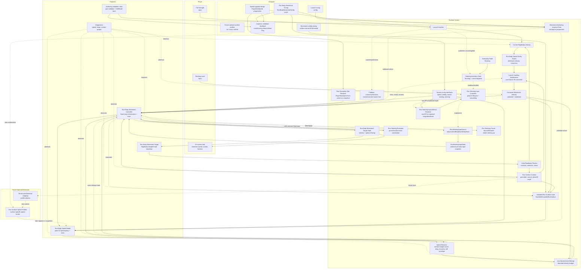

# Run Body Movement And Speed Model Diagram

This artifact gives a high-level overview of the planned **Run Body Movement Controller** and **Run Body Speed Model** split. It is intentionally separate from any PRD so future product or implementation documents can reference it without duplicating the diagram.

## Related Documents

- [ADR-0010: Use Explicit Run Body Speed Model With Rigidbody Contact Physics](../adr/adr-0010-use-explicit-run-body-speed-model-with-rigidbody-contact-physics.md)
- [PRD: Run Body Explicit Speed Ownership](../prd/prd-run-body-explicit-speed-ownership.md)
- [Speed Model Engineering Notes](./run-body-speed-model-engineering-notes.md)
- [Movement Controller Engineering Notes](./run-body-movement-controller-engineering-notes.md)
- [Speed Model Rationale](./run-body-speed-model-rationale.md)

## Actor Responsibilities

- **Player:** supplies pull and steering input, then observes speed, control, obstacle readability, and fairness on screen.
- **Designer:** changes serialized launch, movement, validity, and upgrade configuration; receives fail-fast Inspector validation.
- **Engineer:** changes policy, orchestration, adapters, diagnostics, validation rules, and automated tests.
- **Runtime:** combines validated configuration with current Rigidbody, Run Surface, input, and active-run stat observations.
- **Unity physics:** retains gravity, contacts, collisions, separation, and external normal-velocity behavior.
