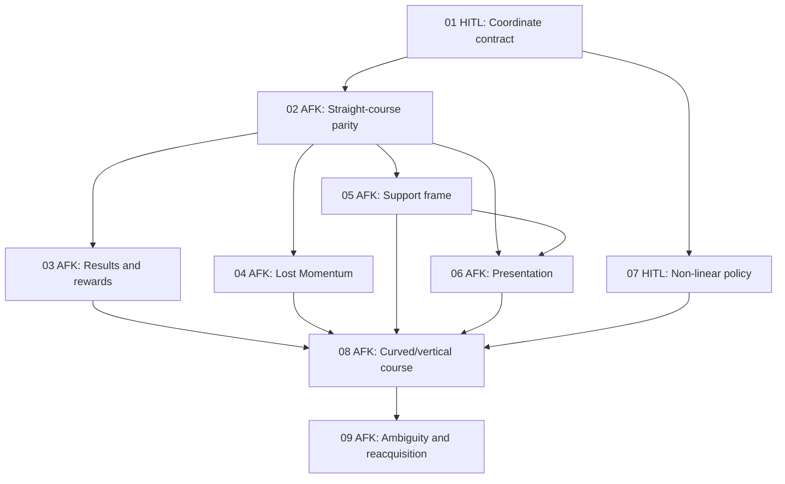

# Continuous Run Course Progress — Local Issues

## Parent

- [Continuous Run Course Progress PRD](../../prd/prd-continuous-run-course-progress.md)

## Approved breakdown

The following tracer-bullet slices are approved for local planning. They are listed in dependency order. Cross-cutting user stories intentionally appear in more than one issue when end-to-end verification is required.

| ID | Type | Title | Blocked by | User stories |
|---|---|---|---|---|
| 01 | HITL | [Approve the Run Course coordinate contract and migration policy](01-approve-run-course-coordinate-contract.md) | None | 14, 29–30, 36–37, 42, 49, 55–56, 82, 85 |
| 02 | AFK | [Ship the straight Run Course sample with exact Ladybug parity](02-ship-straight-run-course-parity.md) | 01 | 9, 16–21, 31–37, 46–49, 54, 57–61, 66, 69, 74–80, 84 |
| 03 | AFK | [Make Run Result and rewards consume final shared progress](03-run-result-and-rewards-use-shared-progress.md) | 02 | 6–8, 30, 37–38, 60, 71, 75, 77–78 |
| 04 | AFK | [Detect Lost Momentum from signed longitudinal course motion](04-lost-momentum-uses-signed-longitudinal-motion.md) | 02 | 3–5, 15, 26–27, 39–42, 64–65, 70, 75, 77–78 |
| 05 | AFK | [Decouple physics support probing from Run Course orientation](05-decouple-support-probing-from-course-orientation.md) | 02 | 13, 22, 52–53, 73, 75, 77–81 |
| 06 | AFK | [Drive character presentation from explicit course and support motion](06-presentation-uses-explicit-course-and-support-motion.md) | 02, 05 | 12, 51, 53, 72, 75, 78–81 |
| 07 | HITL | [Approve non-linear authoring, package, and projection-recovery policy](07-approve-nonlinear-authoring-and-package-policy.md) | 01 | 18–25, 28, 43–45, 50, 55–56, 82–85 |
| 08 | AFK | [Ship one continuous curved and vertical Run Course end-to-end](08-ship-curved-vertical-run-course.md) | 03, 04, 05, 06, 07 | 1–2, 16, 18–23, 31–35, 39, 43–50, 57–63, 66, 69, 74–84 |
| 09 | AFK | [Support hairpins, near-overlaps, teleports, and explicit reacquisition](09-support-ambiguous-projection-and-reacquisition.md) | 08 | 10–11, 23–25, 43–45, 49, 67–69, 74–78, 84 |

## Execution graph

## Deferred work

Branching, loops, and laps are not implementation issues in this set. Before implementation they require a separate approved ADR defining topology, active-route transitions, canonical result progress, and the relationship between canonical progress and physical distance traveled.
