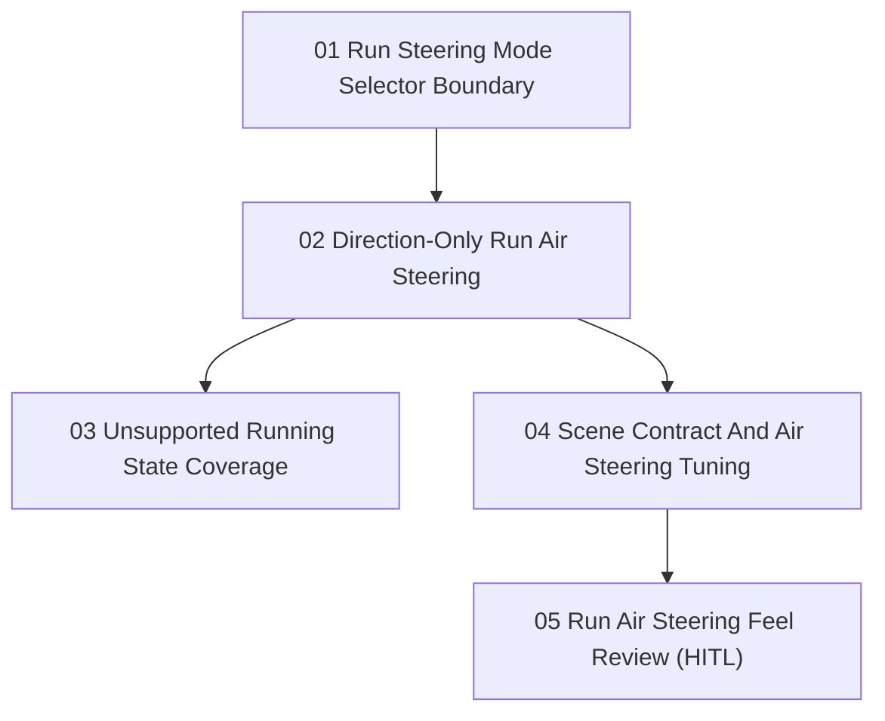

# Run Air Steering Control Issues

Parent PRD: `docs/prd/prd-run-air-steering-control.md`

These issues are ordered by dependency. AFK slices can be implemented without further human input. The HITL slice records the manual feel review for final tuning.

## Issues

1. [Run Steering Mode Selector Boundary](01-run-steering-mode-selector-boundary.md)
   - Type: AFK
   - Blocked by: None
2. [Direction-Only Run Air Steering](02-direction-only-run-air-steering.md)
   - Type: AFK
   - Blocked by: Run Steering Mode Selector Boundary
3. [Unsupported Running State Coverage](03-unsupported-running-state-coverage.md)
   - Type: AFK
   - Blocked by: Direction-Only Run Air Steering
4. [Scene Contract And Air Steering Tuning](04-scene-contract-and-air-steering-tuning.md)
   - Type: AFK
   - Blocked by: Direction-Only Run Air Steering
5. [Run Air Steering Feel Review](05-run-air-steering-feel-review.md)
   - Type: HITL
   - Blocked by: Scene Contract And Air Steering Tuning

## Dependency Shape

## Notes

- The first four issues are implementation and regression-test slices.
- The fifth issue is intentionally HITL because final air turn authority and lift tolerance are feel-tuning decisions.
- All slices preserve the PRD rule: **Run Air Steering Control** changes direction only; **Launch Impulse** owns fired energy, and the grounded **Run Body Speed Model** owns intentional supported tangent-speed effects.
