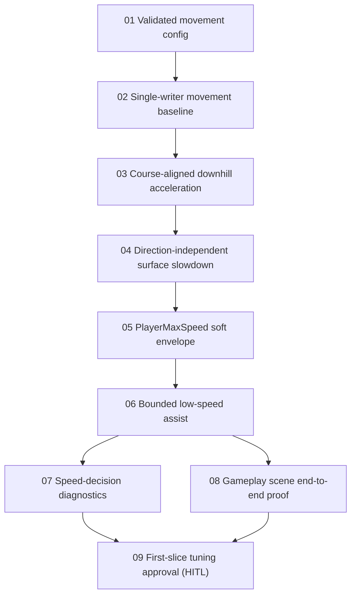

# Run Body Explicit Speed Ownership Issues

Status: Implemented, verified, and movement-feel approved

Parent PRD: [Run Body Explicit Speed Ownership](../../prd/prd-run-body-explicit-speed-ownership.md)

Architecture decision: [ADR-0010: Use Explicit Run Body Speed Model With Rigidbody Contact Physics](../../adr/adr-0010-use-explicit-run-body-speed-model-with-rigidbody-contact-physics.md)

System overview: [Run Body Movement And Speed Model Diagram](../../diagrams/run-body-speed-model.md)

## Existing Foundations

The [Run Body Natural Speed Ownership issue suite](../run-body-natural-speed-ownership/index.md) is historical and remains unchanged. Its implemented post-launch steering gate, direction-only steering, launch-energy regression coverage, scene terminology cleanup, and defensive **Run Body Speed Sanity Guard** are foundations for this suite, not work to repeat.

The replacement PRD and ADR-0010 are authoritative for intentional grounded tangent-speed behavior.

## Issues

| # | Issue | Type | Blocked by | User stories covered |
|---|---|---|---|---|
| 01 | [Migrate Existing Movement Tuning to a Validated Config](01-migrate-existing-movement-tuning-to-validated-config.md) | AFK | None | 17-18, 23-26, 53-55, 60, 68 |
| 02 | [Install the Single-Writer Movement Baseline](02-install-single-writer-movement-baseline.md) | AFK | 01 | 3-6, 15-16, 31, 33-38, 55, 61 |
| 03 | [Add Course-Aligned Downhill Acceleration](03-add-course-aligned-downhill-acceleration.md) | AFK | 02 | 1, 14-15, 19, 32, 37-40, 42, 56-57 |
| 04 | [Add Direction-Independent Surface Slowdown](04-add-direction-independent-surface-slowdown.md) | AFK | 03 | 2, 20, 30, 32, 37-38, 56-57 |
| 05 | [Make PlayerMaxSpeed the Soft Speed Envelope](05-make-player-max-speed-soft-speed-envelope.md) | AFK | 04 | 10-13, 22, 27-28, 41-43, 51-52, 58 |
| 06 | [Add Bounded Low-Speed Assist](06-add-bounded-low-speed-assist.md) | AFK | 05 | 7-9, 16, 21, 44-50, 59 |
| 07 | [Expose Speed-Decision Diagnostics](07-expose-speed-decision-diagnostics.md) | AFK | 06 | 32, 56-60, 65 |
| 08 | [Prove Gameplay Scene Speed Ownership End to End](08-prove-gameplay-scene-speed-ownership-end-to-end.md) | AFK | 06 | 3-13, 57-62, 66, 68 |
| 09 | [Tune and Approve First-Slice Movement Feel](09-tune-and-approve-first-slice-movement-feel.md) | HITL | 07, 08 | 1-13, 17-22, 27-30, 62 |

## Dependency Shape

Issues 07 and 08 can proceed in parallel. Issue 09 begins only when diagnostics and automated scene proof are both available.

## Story Coverage

- Stories 1-62 and 68 are implemented, integrated, or verified by the nine issues. Intentional overlap reflects end-to-end regression coverage, not duplicate ownership.
- Story 63 is satisfied by the approved ADR-0010 and remains a constraint on every implementation issue.
- Story 64 is satisfied by the approved parent PRD.
- Story 65 is satisfied by the standalone actor-aware Mermaid artifact and extended by Issue 07 diagnostics.
- Story 66 is satisfied by preserving the superseded natural-speed PRD and historical issue suite; Issue 08 verifies that authority has moved to this suite without rewriting history.
- Story 67 is satisfied by explicitly deferring **Run Surface Speed Profiles** and terrain/material inference from every first-slice issue.
- No first-slice user story is unaccounted for.

## Suite Constraints

- Unity Rigidbody physics continues to own gravity, contacts, collisions, separation, and externally produced surface-normal velocity.
- The **Run Body Speed Model** owns only intentional valid-grounded surface-tangent speed effects.
- **Run Steering Control** remains direction-only.
- The **Run Body Speed Sanity Guard** remains defensive and is not gameplay balance tuning.
- The first slice uses global/default speed tuning; surface profiles and terrain/material inference remain deferred.
- No Unity version, package dependency, package manifest, Addressables, ProjectSettings, save-format, or UPM release change is part of this suite.
