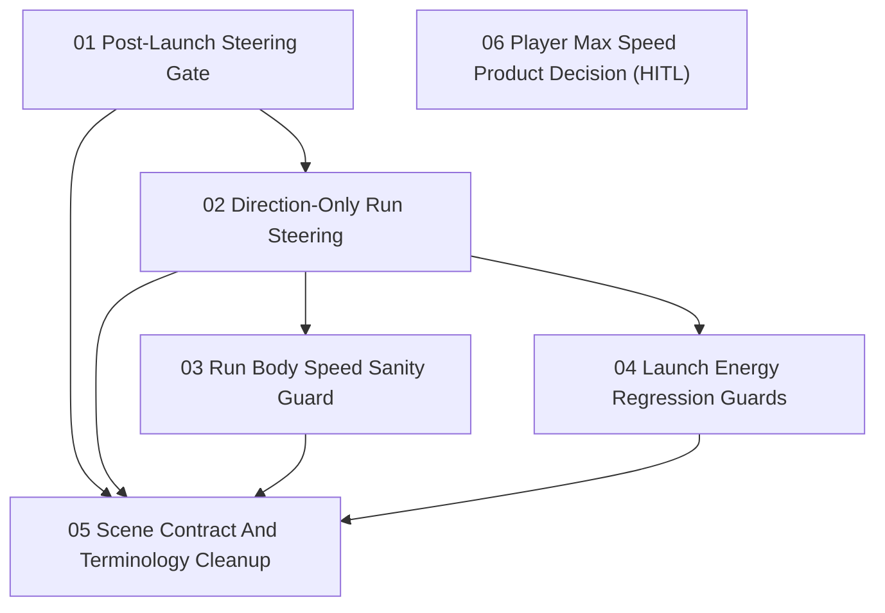

# Run Body Natural Speed Ownership Issues

Parent PRD: `docs/prd/prd-run-body-natural-speed-ownership.md`

These issues are ordered by dependency. AFK slices can be implemented without further human input. The HITL slice records a product decision that should not block the movement fix.

## Issues

1. [Post-Launch Steering Gate](01-post-launch-steering-gate.md)
   - Type: AFK
   - Blocked by: None
2. [Direction-Only Run Steering](02-direction-only-run-steering.md)
   - Type: AFK
   - Blocked by: Post-Launch Steering Gate
3. [Run Body Speed Sanity Guard](03-run-body-speed-sanity-guard.md)
   - Type: AFK
   - Blocked by: Direction-Only Run Steering
4. [Launch Energy Regression Guards](04-launch-energy-regression-guards.md)
   - Type: AFK
   - Blocked by: Direction-Only Run Steering
5. [Scene Contract And Terminology Cleanup](05-scene-contract-and-terminology-cleanup.md)
   - Type: AFK
   - Blocked by: Post-Launch Steering Gate, Direction-Only Run Steering, Run Body Speed Sanity Guard, Launch Energy Regression Guards
6. [Player Max Speed Product Decision](06-player-max-speed-product-decision.md)
   - Type: HITL
   - Blocked by: None

## Dependency Shape

## Notes

- Issue 6 is intentionally non-blocking for issues 1-5. The movement bug can be fixed while the player-facing meaning of any Player Max Speed upgrade is decided separately.
- The implementation issues should preserve the PRD rule: **Run Steering Control** steers direction; **Run Surface Contact Slowdown** owns ordinary speed loss.
