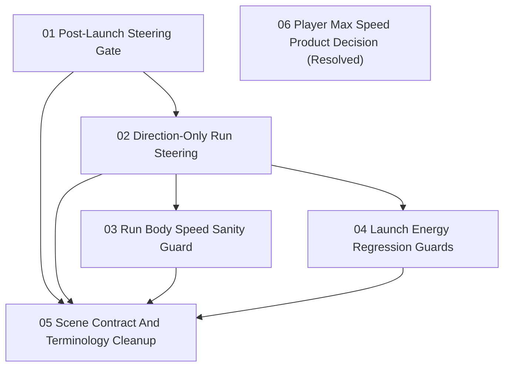

# Run Body Natural Speed Ownership Issues

Status: Historical issue suite; parent PRD superseded

Parent PRD: `docs/prd/prd-run-body-natural-speed-ownership.md`

Replacement PRD: [Run Body Explicit Speed Ownership](../../prd/prd-run-body-explicit-speed-ownership.md)

These issues preserve the earlier steering-cap and launch-recovery cleanup. The replacement PRD and ADR-0010 now own intentional grounded speed behavior. The former HITL product decision is resolved.

## Issues

1. [Post-Launch Steering Gate](01-post-launch-steering-gate.md)
   - Type: AFK
   - Blocked by: None
2. [Direction-Only Run Steering](02-direction-only-run-steering.md)
   - Type: AFK
   - Blocked by: Post-Launch Steering Gate
3. [Run Body Speed Sanity Guard](03-run-body-speed-sanity-guard.md)
   - Type: AFK
   - Blocked by: Direction-Only Run Steering
4. [Launch Energy Regression Guards](04-launch-energy-regression-guards.md)
   - Type: AFK
   - Blocked by: Direction-Only Run Steering
5. [Scene Contract And Terminology Cleanup](05-scene-contract-and-terminology-cleanup.md)
   - Type: AFK
   - Blocked by: Post-Launch Steering Gate, Direction-Only Run Steering, Run Body Speed Sanity Guard, Launch Energy Regression Guards
6. [Player Max Speed Product Decision](06-player-max-speed-product-decision.md)
   - Type: Resolved HITL decision
   - Blocked by: None

## Dependency Shape

## Notes

- Issue 6 resolves `PlayerMaxSpeed` as the modifier for the soft **Run Body Speed Envelope**.
- Issues 1-5 remain useful historical slices for direction-only steering, launch/landing boundaries, and the defensive sanity guard.
- New implementation follows the replacement rule: **Run Steering Control** owns direction; **Run Body Speed Model** owns intentional grounded tangent-speed effects; Rigidbody physics owns contacts and collision response.
