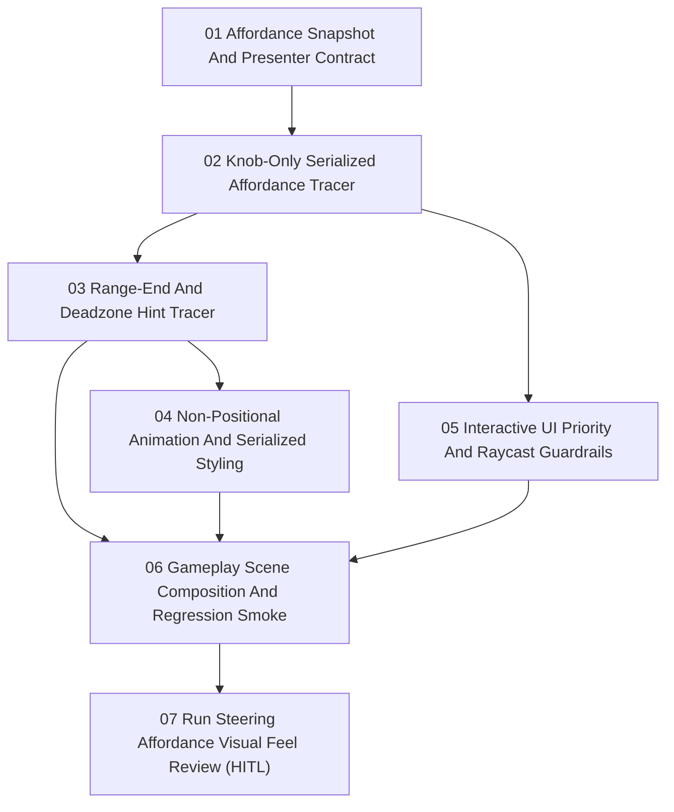

# Run Steering Affordance Issues

Parent PRD: `docs/prd/prd-run-steering-affordance.md`

Approved local implementation issue set for the first **Run Steering Affordance** slice. Issues are ordered by dependency. AFK slices can be implemented without further human input. The final HITL slice records the manual visual feel review and final serialized tuning pass.

| ID | Title | Type | Blocked by | File |
| --- | --- | --- | --- | --- |
| 01 | Affordance Snapshot And Presenter Contract | AFK | None | `01-affordance-snapshot-and-presenter-contract.md` |
| 02 | Knob-Only Serialized Affordance Tracer | AFK | 01 | `02-knob-only-serialized-affordance-tracer.md` |
| 03 | Range-End And Deadzone Hint Tracer | AFK | 02 | `03-range-end-and-deadzone-hint-tracer.md` |
| 04 | Non-Positional Animation And Serialized Styling | AFK | 03 | `04-non-positional-animation-and-serialized-styling.md` |
| 05 | Interactive UI Priority And Raycast Guardrails | AFK | 02 | `05-interactive-ui-priority-and-raycast-guardrails.md` |
| 06 | Gameplay Scene Composition And Regression Smoke | AFK | 03, 04, 05 | `06-gameplay-scene-composition-and-regression-smoke.md` |
| 07 | Run Steering Affordance Visual Feel Review | HITL | 06 | `07-run-steering-affordance-visual-feel-review.md` |

## Dependency Shape

## Shared Constraints

- **Run Steering Affordance** is presentation-only over existing **Run Steering Control**.
- Existing Run Steering Origin, Run Steering Range, Run Steering Deadzone, active pointer lifecycle, and Run Steering Responsiveness semantics must remain unchanged.
- The UI hierarchy must be authored and serialized in a scene or prefab; do not create the joystick UI hierarchy at runtime.
- Affordance UI must be non-interactive and raycast-transparent.
- Every production GameplayLifetimeScope requires the serialized affordance view; isolated controller and presenter tests use injected fakes.
- Active knob position must update immediately from current horizontal displacement; do not add active smoothing, spring lag, or return-to-origin tweening.
- No horizontal rail, track, line, capsule, fixed joystick base, arrows, labels, haptics, audio, analytics, Addressables, or save migration in this issue set.
- Use Unity AI Agent Connector compile before tests during implementation.
